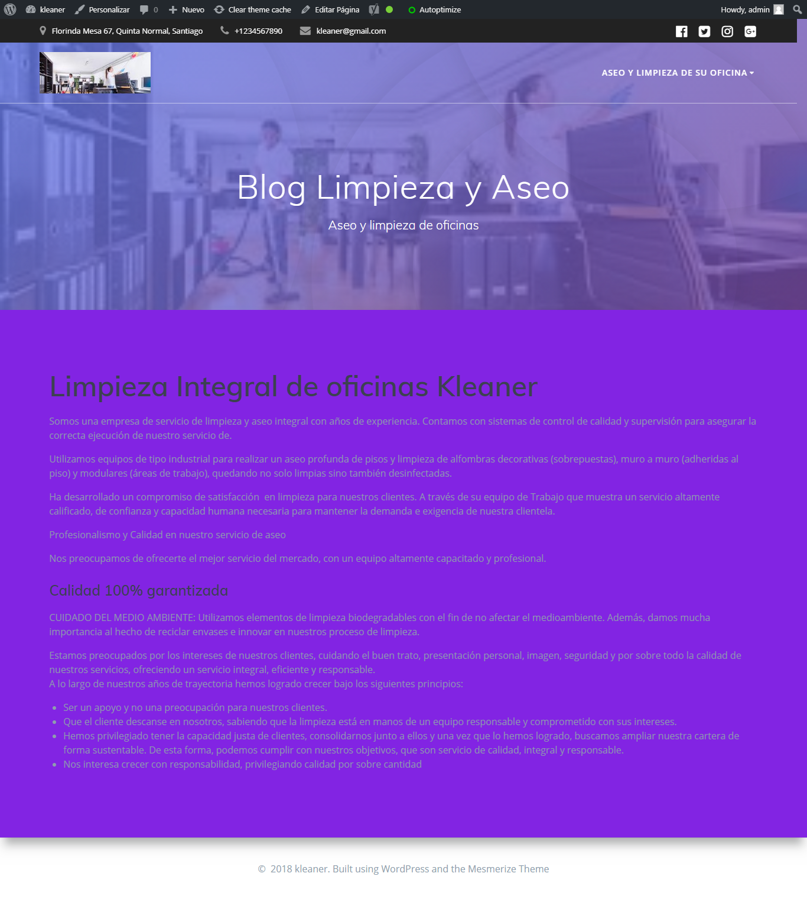

#Información empresa:
Empresa: Kleaner S.A.
Dirección: Florinda Mesa 67, Quinta Normal, Santiago
Rubro: Aseo de oficinas
Clientes: Medianas y grandes empresas que no quieren contratar personal de aseo.
Qué hace diferente a su empresa: Nuestro servicio integral basado en la confianza y rapidez
Palabras usadas en su rubro: Aseo, limpieza de oficinas, servicio de limpieza, servicio externo de limpieza, limpieza de oficinas Santiago

#Requisitos generales:
Página web:
Instalar Wordpress de manera local
Descargar desde el repositorio de Wordpress el siguiente 

tema: Descarga el tema Mesmerize:
Luego de instalar y activar el tema, descarga los plugins que pide el tema.
Al terminar de activar los plugins, crea dos páginas; una llamada inicio y el otro blog, además de una entrada. Después, configura el inicio y el blog para que estén por defecto.

#Desarrollo
##Usando paginas  como :
#https://neilpatel.com/ubersuggest/
#http://mergewords.com/
##se llega a las siguientes combinaciones para usar en nuestro blog creado en WP.
 - servicio integral limpieza oficinas
 - servicio integral aseo oficinas
 - servicio integral  oficinas
 - rápido limpieza oficinas
 - rápido aseo oficinas
 - rápido  oficinas
 - confiable limpieza oficinas
 - confiable aseo oficinas
 - confiable  oficinas
 - limpieza oficinas
 - aseo oficinas
 - oficinas
 - limpieza oficinas
 - aseo oficinas
 - oficinas

